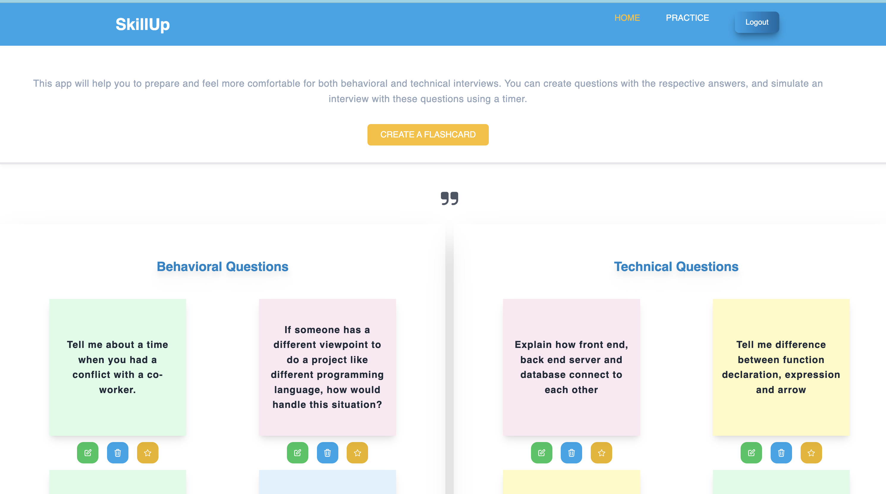

# SkillUp

## Overview: 

---

The SkillUp application addresses the common challenges faced by non-native English speakers and individuals in general when it comes to interviews. Designed with the aim of assisting candidates in their interview preparation, this application offers users the ability to formulate interview questions along with corresponding answers and engage in interview simulations with the help of a timer, ultimately enhancing their interview performance and increasing their chances of success.

---

## Features: 

* Create flashcards to practice questions and answers
* Add specific questions to the practice page and simulate a real interview
* Voice reader for practice questions

---

## Screenshot(s):

---
## Technologies Used:

* [Web Speech API](https://developer.mozilla.org/en-US/docs/Web/API/Web_Speech_API)
* [Node.js](https://nodejs.org/)
* [Express](https://expressjs.com/)
* [PostgreSQL](https://www.postgresql.org/)
* [Sequelize](https://sequelize.org/)
* [Axios](https://axios-http.com/)
* [JSON Web Token](https://jwt.io/)
* [Bcrypt](https://www.npmjs.com/package/bcrypt)
* [HTML](https://www.w3schools.com/html/)
* [Javascript](https://www.javascript.com/)
* [Tailwindcss](https://tailwindcss.com/)

---
## Getting Started:

http://35.175.146.220/

---
## Installation
* Clone this repository
* Navigate to the project directory: cd SkillUp
Install dependencies: npm install

---

## Usage
1. Create a .env file in the project root and add your keys:
... CONNECTION_STRING=your_connection_string_for_database
... SECRET=your_secret_word
2. Access the app in your browser at: http://localhost:4000

---

### Icebox:

* Improve login/SignUp feature
* Add newsletter to send interviews tip
* Add voice options for user, like pitch, rate and voices options.

---
### References:
* Swiper: https://swiperjs.com/
* Alertify: https://alertifyjs.com/
